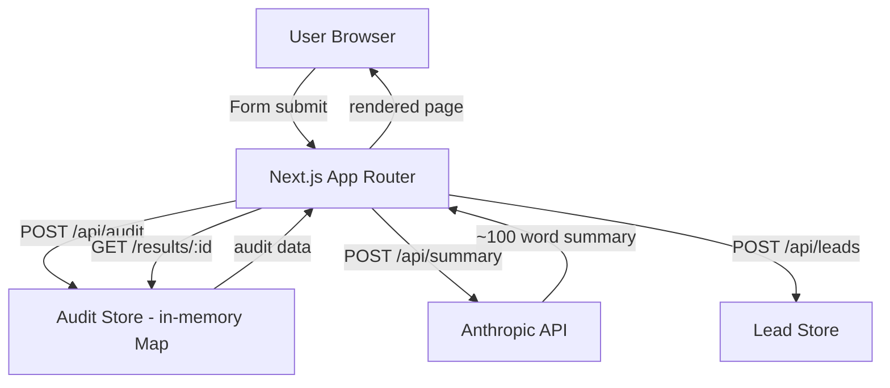

# Architecture — SpendLens

## System Diagram

## Data Flow: Input → Audit Result

1. User fills form → Zustand store (persisted in localStorage)
2. Submit → `runAudit(formData)` runs client-side in `lib/auditEngine.ts`
3. Result + formData POSTed to `/api/audit` → stored with nanoid key
4. Browser redirects to `/results/:id`
5. Results page fetches audit by id, then fires `/api/summary` for AI narrative
6. AI summary streamed in after page load (graceful fallback if API fails)
7. User optionally submits email → `/api/leads` with honeypot + rate limit protection

## Stack

| Layer | Choice | Reason |
|-------|--------|--------|
| Framework | Next.js 15 (App Router) | API routes + SSR metadata + Vercel deploy in one |
| Language | TypeScript | Required for audit engine correctness; catches plan/price mismatches at compile time |
| Styling | Tailwind CSS | Fast iteration; no CSS files to manage |
| State | Zustand + persist | Minimal boilerplate, localStorage built-in |
| AI | Anthropic claude-haiku-4-5 | Fast, cheap, sufficient for 100-word summaries |
| Storage | In-memory Map | MVP-appropriate; swap to Supabase for production |
| Deploy | Vercel | Zero-config Next.js, edge functions, OG image support |

## Scaling to 10k Audits/Day

1. **Replace Map with Supabase** — One env var swap. Audits table: `id, form_data jsonb, result jsonb, created_at`. Index on `id`.
2. **Rate limit via Upstash Redis** — Sliding window per IP. Vercel Edge middleware.
3. **AI summary as background job** — Queue via Vercel Cron or QStash; cache results in DB so repeat views don't re-call Anthropic.
4. **CDN for result pages** — `/results/:id` pages are cacheable after first render. ISR with 60s revalidation.
5. **Lead storage** — Supabase `leads` table + webhook to CRM (HubSpot/Pipedrive).
